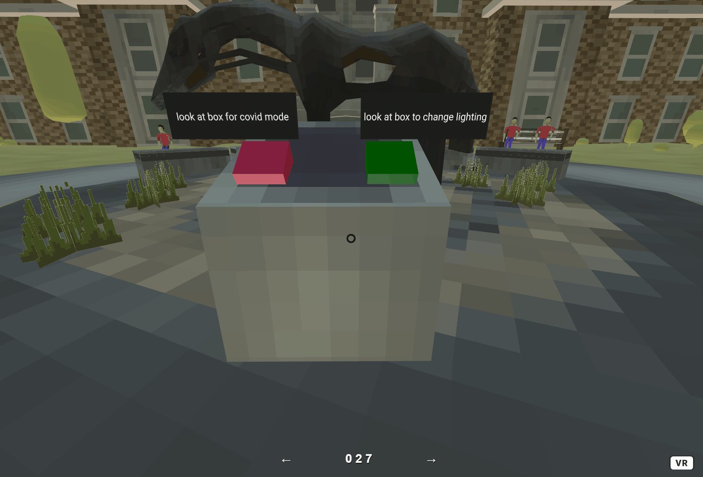

# LuisEduardoSandoval.github.io
VR project 1 Murry Hall Environment.


Interactions:


there are 2 cubes placed on the podium that can be interacted with the first one is a lighting box that changes the lighting of
the sky when looked at.


The lighting cube works by taking the eventlistener library and check for a click(in this case a binding which is basically staring in vr)
and once this event has happend a timer counts upwards switching between two states(red and green) and a sound is played.

``` javascript 
AFRAME.registerComponent('day-night',{
  schema:{
    position: {default: '0, 0, 0'}
  },
  init: function()
  {
    var data = this.data;
    var el = this.el;
    var boxel= document.querySelector('#box');
    let sound2 =document.querySelector('#ring');
    var clicks = 0;


    //var defaultPosition = el.getAttribute('lightPosition').data;

    boxel.addEventListener('click',function()
    {
      


      if (clicks%2 === 0)
      {
        el.setAttribute('environment',{lightPosition: '-10  -10 -10.2'});
        boxel.setAttribute('color', 'green');
        sound2.components.sound.playSound();
        clicks+=1;
        
      }
      else
      {
        el.setAttribute('environment',{lightPosition: '0  -1 0.2'});
        boxel.setAttribute('color', 'red');
        sound2.components.sound.playSound();
        clicks+=1;
      }

      
      console.log(el.getAttribute('environment','skyColor'));

    });
     //working
    //console.log(el.getAttribute('enviorment', 'lightPosition'));
    

  }
});
```

The next ineraction is the covid box which changes the environment by hiding all the people, this is a depiction of how covid has affected society as there are far fewer people on campus. Very simmilarly to the previous script however this one hides the objects.



``` javascript
    init: function()
    {
      var data = this.data;
      var el = this.el;
      var CovidBoxel= document.querySelector('#CovidBox');
      var CovidText=document.querySelector('#covidText');
      var humanel = document.querySelector('#human');
      var humanel1 = document.querySelector('#human1');
      
      var humanel2 = document.querySelector('#humanSit');
      var humanel3 = document.querySelector('#humanSit1');
      var clicks=0;

      let sound =document.querySelector('#ring');
      
      CovidBoxel.addEventListener('click',function()
      {
          if(clicks%2 === 0)
          {
            CovidBoxel.setAttribute('color', 'green');
            humanel.setAttribute('visible', false);
            humanel1.setAttribute('visible', false);

            humanel2.setAttribute('visible', false);
            humanel3.setAttribute('visible', false);

            CovidText.setAttribute('value','look again to turn off covid mode');

            sound.components.sound.playSound();
            clicks+=1;

            
            
          }
          else
          {
            CovidBoxel.setAttribute('color', 'red');
            humanel.setAttribute('visible', true);
            humanel1.setAttribute('visible', true);


            humanel2.setAttribute('visible', true);
            humanel3.setAttribute('visible', true);
            CovidText.setAttribute('value','look at box for covid mode');

            sound.components.sound.playSound();
            clicks+=1;


          }
          console.log(clicks);


      });
       //working
      //console.log(el.getAttribute('enviorment', 'lightPosition'));
      

    }
  });
  ```
  
  There is a ball that can be interacted with using a physics script and a dynamic body. there is a plane that is hidden to keep the ball from falling through the floor.
  
  


