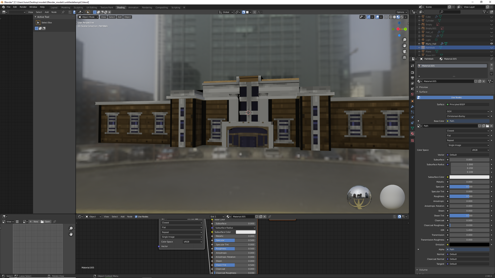
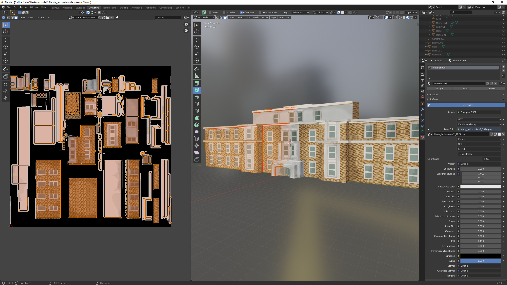
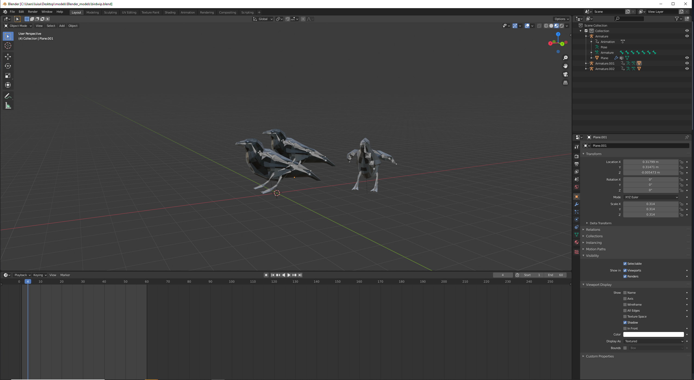
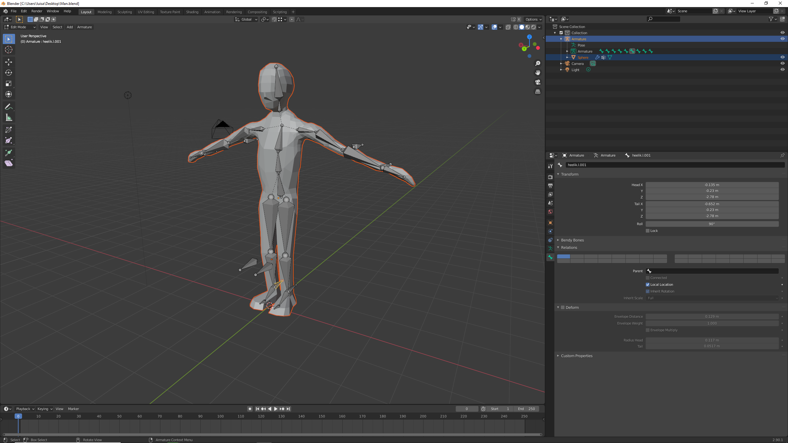

# LuisEduardoSandoval.github.io
VR project 1 Murry Hall Environment.

Link to video: https://www.youtube.com/embed/hFfxNg0sPPk


Link to demo: https://luiseduardosandoval.github.io/


Controls:

Move using: WASD or Arrowkeys on PC
mouse to look around

Mobile: move by tapping the screen look down to move back.
gyroscope to move around

Note: in the images there is white text for lighting at the bottom of the screen this has been removed. Also shadows have been removed for the frame rate performance.


Interactions:


There are 2 cubes placed on the podium that can be interacted with. The first one is a lighting box that changes the lighting of
the sky when looked at.


The lighting cube works by taking the eventlistener library and check for a click(in this case a binding which is basically looking at in vr)
and once this event has happend a timer counts upwards switching between two states(red and green) and a sound is played.

``` javascript 
AFRAME.registerComponent('day-night',{
  schema:{
    position: {default: '0, 0, 0'}
  },
  init: function()
  {
    var data = this.data;
    var el = this.el;
    var boxel= document.querySelector('#box');
    let sound2 =document.querySelector('#ring');
    var clicks = 0;


    //var defaultPosition = el.getAttribute('lightPosition').data;

    boxel.addEventListener('click',function()
    {
      


      if (clicks%2 === 0)
      {
        el.setAttribute('environment',{lightPosition: '-10  -10 -10.2'});
        boxel.setAttribute('color', 'green');
        sound2.components.sound.playSound();
        clicks+=1;
        
      }
      else
      {
        el.setAttribute('environment',{lightPosition: '0  -1 0.2'});
        boxel.setAttribute('color', 'red');
        sound2.components.sound.playSound();
        clicks+=1;
      }

      
      console.log(el.getAttribute('environment','skyColor'));

    });
     //working
    //console.log(el.getAttribute('enviorment', 'lightPosition'));
    

  }
});
```

The next ineraction is the covid box which changes the environment by hiding all the people. This is a depiction of how covid has affected society as there are far fewer people on campus. Very simmilarly to the previous script however this one hides the objects by obtaining the objects element.


``` javascript
    init: function()
    {
      var data = this.data;
      var el = this.el;
      var CovidBoxel= document.querySelector('#CovidBox');
      var CovidText=document.querySelector('#covidText');
      var humanel = document.querySelector('#human');
      var humanel1 = document.querySelector('#human1');
      
      var humanel2 = document.querySelector('#humanSit');
      var humanel3 = document.querySelector('#humanSit1');
      var clicks=0;

      let sound =document.querySelector('#ring');
      
      CovidBoxel.addEventListener('click',function()
      {
          if(clicks%2 === 0)
          {
            CovidBoxel.setAttribute('color', 'green');
            humanel.setAttribute('visible', false);
            humanel1.setAttribute('visible', false);

            humanel2.setAttribute('visible', false);
            humanel3.setAttribute('visible', false);

            CovidText.setAttribute('value','look again to turn off covid mode');

            sound.components.sound.playSound();
            clicks+=1;

            
            
          }
          else
          {
            CovidBoxel.setAttribute('color', 'red');
            humanel.setAttribute('visible', true);
            humanel1.setAttribute('visible', true);


            humanel2.setAttribute('visible', true);
            humanel3.setAttribute('visible', true);
            CovidText.setAttribute('value','look at box for covid mode');

            sound.components.sound.playSound();
            clicks+=1;


          }
          console.log(clicks);


      });
       //working
      //console.log(el.getAttribute('enviorment', 'lightPosition'));
      

    }
  });
  ```
  
  There is a ball that can be interacted with using a physics library and a setting the ball to a dynamic body. there is a plane that is hidden to keep the ball from falling through the floor.
  
  
  
 Animations:


The humans move around the scene using a path script there are 3 points positioned on the path.

They move using a library and this code to create a "track" or path.

``` javascript
    <a-curve id="track1">
        <a-curve-point position="25 0 0" geometry="primitive:box; height:0.1; width:0.1; depth:0.1" material="color:#ff0000"></a-curve-point>
        <a-curve-point position="12 0 10" geometry="primitive:box; height:0.1; width:0.1; depth:0.1" material="color:#ff0000"></a-curve-point>
        <a-curve-point position="-20 0 0" geometry="primitive:box; height:0.1; width:0.1; depth:0.1" material="color:#ff0000"></a-curve-point>
    </a-curve>
```

I have created crows as the time has been extended which can be found on the right of the path, and i was able to add trees which there are four of.

Sounds:


There are 2 sounds implemented using free sounds
one is a track of a forest on repeat
and the other is when the button event is triggered


references:

https://aframe.io/docs/1.0.0/introduction/ : for the script events

https://blog.mozvr.com/aframe-environment-component/ : for the environment components

https://github.com/protyze/aframe-alongpath-component : for the path component

https://www.youtube.com/channel/UC2U5mRfclG1Rrr1ztNkpGKA : for the animation guide.


Libraries:

Path Script: "https://rawgit.com/protyze/aframe-curve-component/master/dist/aframe-curve-component.min.js"


for the use of creating a path for models to walk.


Environment Handler Script: https://unpkg.com/aframe-event-set-component@3.0.3/dist/aframe-event-set-component.min.js


for the use of button events.


Physics Script: //cdn.rawgit.com/donmccurdy/aframe-extras/v3.13.1/dist/aframe-extras.min.js


for the use of a ball to be interacted with.


Enviroment Script: https://cdn.jsdelivr.net/gh/supermedium/aframe-environment-component/dist/aframe-environment-component.min.js


for the use of the background scenery i.e. small hills and green trees.


Mobile Script: https://rawgit.com/Ctrl-Alt-Zen/aframe-mobile-controls/master/components/twoway-motion/twoway-motion.js


for being able to move on mobile.


Models and textures:
all models and textures were custom made and can be found in asset folders
 
I decided to make low poly figures as it would not lower preformance i attempted to keep poly count low and 
used pixel art for texture work as this would have the a smaller impact on the engine.
 
 
in the case of murry hall. it went under several revisions as i was not happy with the initial product.


I had originally retextured the model twice before i ended up realising the windows were to detailed.
So I remade the model.


all animations as well were custom made: 
due to my lack of knowledge in animation and time constraints the animations are rather lack luster but none the less was a fun project to work on. 




Sounds:
sounds were obtained from bigsoundbank.com

https://bigsoundbank.com/detail-0100-forest.html 


there was a single soccor ball texture used as i couldn't figure out how to wrap custom made materials around a sphere and was taking too much time
https://images.designtrends.com/wp-content/uploads/2016/09/17145735/Soccer-ball-Texture1.jpg

